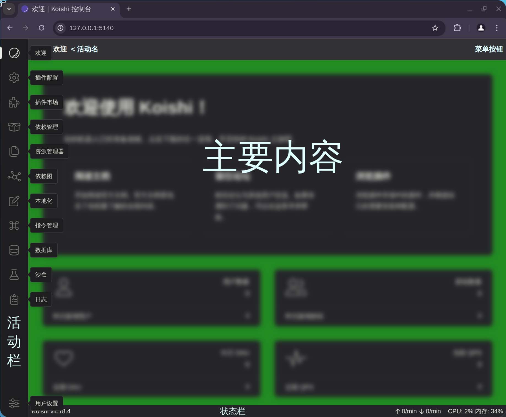

# 认识 Koishi 控制台

您可以使用现代浏览器访问 Koishi 控制台

[[toc]]

## 基础布局

上方为 **标题栏** 及 **菜单按钮**  
左侧为 **活动栏**  
下方为 **状态栏**  
中间为 **活动内容**

部分页面还包含 **侧栏** (如图, 来自 [插件配置](./builtins/index#插件配置-plugin-config) 页面)

{width=500}

## 头部

### 标题栏
当前活动提供的标题

### 菜单按钮
由当前活动提供的菜单项目(按钮),
如 [插件配置](./builtins/index#插件配置-plugin-config) 页面中, 
通过菜单中的按钮管理插件状态

## 活动栏
展示了所有活动, 最下方为用户设置

## 状态栏
展示了 Koishi 的状态

### 左侧
鼠标悬停可以看到 Koishi 版本信息, 
操作系统和运行环境信息等

### 右侧
您可以看到消息发送状况, Koishi 进程的 CPU 及内存占用
如果您配置了平台适配器, 
您还可以看到机器人状态指示器

## 接下来

<a href="./builtins/index">
    <Card v-ripple>
        <template #content>
            预装插件介绍
        </template>
    </Card>
</a>

