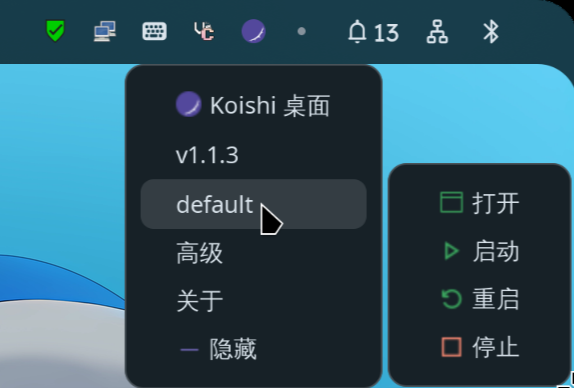
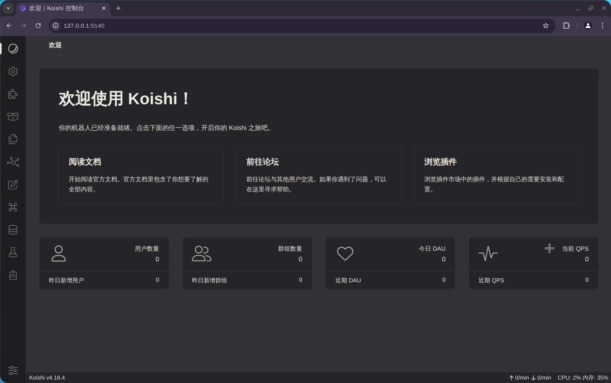

# 打开 Koishi 控制台

### Koishi Desktop
如果您使用 [Koishi Desktop](https://github.com/koishijs/koishi-desktop)  

右键点击托盘 (System Tray) 上的 Koishi 图标,  
选择 「default」 > 「打开」, 即可打开 Koishi 控制台


### 模板
如果您使用 Koishi 模板项目, 您应该可以在控制台日志中看到类似内容

```log
[I] app Koishi/4.18.4
[I] loader apply plugin group:entry
[I] loader apply plugin group:server
[I] loader apply plugin group:basic
[I] loader apply plugin group:console
[I] loader apply plugin group:storage
[I] loader apply plugin group:adapter
[I] loader apply plugin group:develop
[I] server server listening at http://127.0.0.1:5140
[I] console webui is available at http://127.0.0.1:5140 // [!code focus]
```


::: info NOTE
Koishi 默认使用 5140 端口, 如果端口被占用或手动修改了相关配置,
可能实际端口会有所不同
:::

跟随指示访问 [`http://127.0.0.1:5140/`](http://127.0.0.1:5140/)

---

成功打开控制台后, 您应该可以看到如下页面

